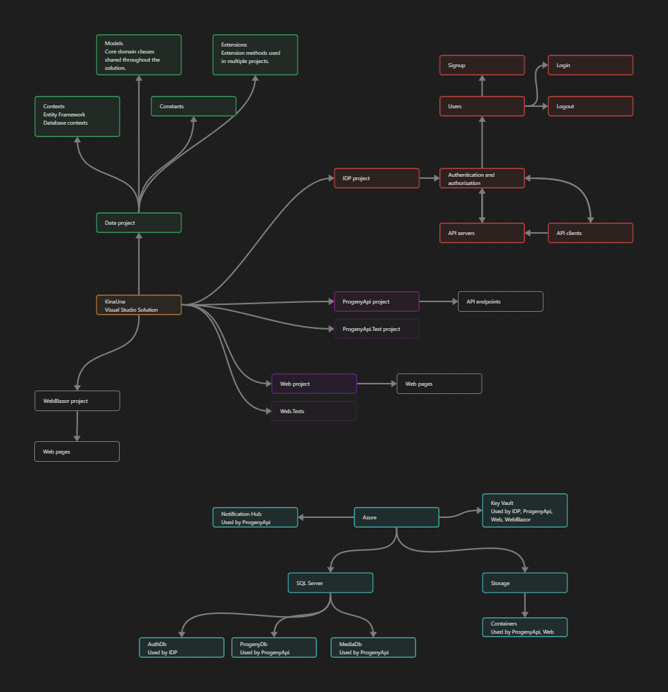

# KinaUnaAzure

KinaUna is an app for managing family data, and the KinaUnaAzure solution contains the backend APIs, frontend web app, and IdentityServer.

The APIs and IdentityServer are also intended to be used by mobile apps.
A mobile app exists here: [https://github.com/KinaUna/KinaUnaXamarin](https://github.com/KinaUna/KinaUnaXamarin) 
For now it is too much work for me to keep the mobile app updated and dealing with the frequently changing requirements, so currently it is not being updated and shouldn't be used anymore.

KinaUna was initially a simple ASP.Net MVC solution for learning about ASP.Net, MVC, JavaScript, and Visual Studio, but it quickly turned into an app I and my family used regularly.

So, it has slowly and steadily evolved with new features and adding more and more technologies, principles, patterns.

It's been mostly a vehicle for learning and for my own family's use, so many patterns, practices, and principles are only superficially implemented. I.e. I wanted to learn about microservices, so I separated the api's from the frontend app into their own servers. 
Initially I added two servers, but to keep costs down I merged them back into one single api server. In principle, the api server could and should be separated into many more servers.
This also means that I have done very little in terms of optimization.

Documentation is sparse at this point, because I believe it improves learning if I have to think deeper and work harder when looking at old code, and experiencing unexpected results when updating code has taught me some valuable lessons. 
I think the time has come to add proper documentation, so this should improve steadily going forward.

It is designed for deployment to Azure Web Apps, with SQL Server database for persisting data and Azure Blobs for images. SignalR is used for realtime updates.
Generally I have tried to use DI to avoid tight coupling with these depencies, so it should be possible to use alternate solutions without too much work, but I haven't explicitly designed it for portability.

### Services/resources used and configuration

Configuration values are stored in appsettings.json, appsettings.Development.json, User Secrets, and Azure Key Vault.

#### Azure

Azure Web Apps: 3 Web App services are used, one for the Web front end, one for API, and one for the Authentication/Authorization services.

Azure Storage Account: A storage account is used for uploading images and other files.

Database: A SQL server with 3 databases. A database for Identity Server, a database for ProgenyApi, a database for MediaApi (although the Progeny and Media Apis have been merged the data haven't).

Azure KeyVault: A key vault is used to store secrets shared between the Web Apps.

Azure Notification Hub: For push messaging.

Azure App Insights: Used for logging and analytics.

#### Email

An email account is need for account creation confirmation emails, password reset and such.

#### Syncfusion

A syncfusion license is needed for a few componenents, such as Rich Text Editor (Notes, admin pages text editing) and Scheduler (calendar).

#### Here Maps 

A Here Maps account is needed for showing locations on a map.

#### Vapid Keys
A private and a public vapid key is needed for sending web notifications.

#### Login providers

If you wish to use log in with [Apple, Google, Microsoft, etc] account you will need to obtain credential for that from each of these service providers.

Todo: Configuration Templates, showing where to put the above information and how to obtain it.

### The fundamental requirements for me:
- Users should be in control of all access to their data.
- All access to data needs to verify that the current user should be allowed to access it. Static files, such as pictures should also have restricted access.
- Privacy is very important, personal data should never be visible to anyone not explicitly authorized to access it. For example, email addresses should not appear in urls and logs.
- Multilingual, it needs to support viewing content in multiple languages.

### Initial features:
- Add/remove family member (currently it is add/remove child, but you can add any person)
- Access management (control who has access to your content)
- Timeline (view all content in chronological order)
- Notes (use notes for anything that doesn't fit in the other types of content)
- Calendar
- Pictures (picture gallery, picture information, tags, comments)
- Videos (video gallery, video information, tags, comments)
- Sleep (collect sleep data)
- Skills (record when skills are acquired)
- Vocabulary
- Measurements (track height and weight)
- Contacts
- Friends
- Locations (places lived, visited, or just of interest)
- Vaccinations
- Profile management
- For KinaUna administrators: 
    - Manage translations
    - Manage page texts (about page, terms and conditions, privacy, etc.)
    - Manage supported languages

### Currently wanted/missing features:
- Landing page
- Help and support
- Search
- Reminders

### Potential future features:
- Todo
- Kanban
- Messaging
- Documents
- Copy items to another person
- For KinaUna administrators: 
    - Manage users
    - Send messages to users
    - Analytics tools (currently done with Application Insights)
- Manage home:
    - Inventory (appliances, devices, spare parts)
    - Schedule maintenance
    - Plan improvments
    - Contacts (for services)
    - Documents
    - ... and more
- Manage vehicles:
    - Schedule maintenance
    - Data collection (milage, fuel, oil, filters, tire lifetime, brake lifetime)
    - Contacts (for services)
    - Documents
    - ... and more

### Solution architecture
The code is organized into 4 core projects, 2 test projects, and 1 experimental project:
- KinaUna.Data: Shared data, models, constants for the other projects.
- KinaUna.IDP: The identity, authorization, authentication service.
- KinaUnaProgenyApi: The API for the web app and mobile app. (This used to be split in two, with a separate MediaApi, but to reduce costs they were merged)
- KinaUnaProgenyApi.Tests: For xUnit unit tests.
- KinaUnaWeb: The web application.
- KinaUnaWeb.Tests: For xUnit unit tests.
- KinaUnaWebBlazor: For experimenting with Blazor.

Initially I also wanted to learn about microservice architecture and planned on having a project/service for each type of data. Unfortunately that would increase costs too much for me, though for many businesses it shouldn't be too expensive to deploy more microservices.

There was a KinaUnaMediaApi early on, but the Api endpoints where merged into the KinaUnaProgenyApi project. This was fairly straightforward to do, I just had to move the Controllers, Services and DbContexts from one project to another and set the DNS to point MediaApi requests to the ProgenyApi instead. 

I expect to do the reverse, splitting ProgenyApi up into separate services/projects would just involve moving the same items, update the IDP Config.cs with the new APIs, update the Web HttpClients to use the new endpoints. 
